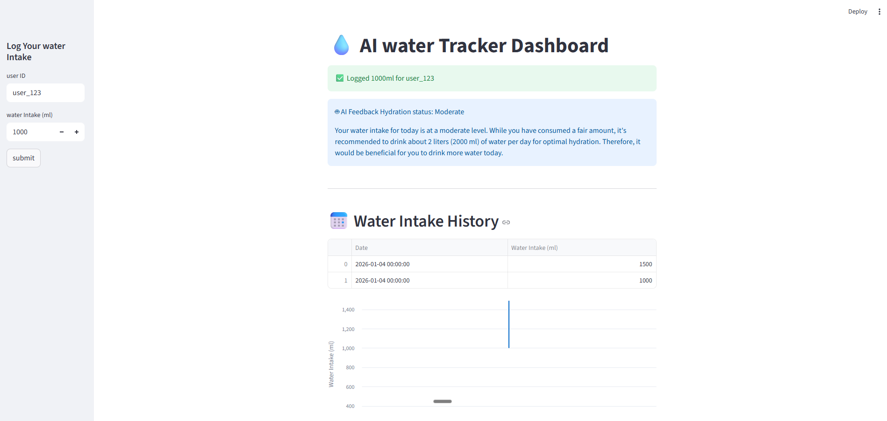

# Water Tracker AI Agent

A full-stack hydration assistant that logs daily water intake, stores history, and uses an LLM to generate personalized feedback in real time.



## Why this project stands out
- Combines a clean Streamlit UX with an AI feedback loop so the user gets instant, actionable insights.
- Persists intake history in SQLite and visualizes trends over time with built-in charts.
- Exposes a FastAPI backend for programmatic logging and retrieval, enabling future mobile or wearable integrations.

## Features
- Log water intake per user and receive AI-generated hydration guidance.
- View historical intake data as a table and line chart.
- FastAPI endpoints for logging and history lookup.
- Simple local setup with `.env`-based OpenAI API configuration.

## Tech stack
- Python
- Streamlit UI
- FastAPI + Pydantic
- SQLite
- LangChain + OpenAI

## Architecture
- `dashboard.py` handles the Streamlit user interface.
- `src/api.py` exposes REST endpoints for intake logging and history.
- `src/database.py` writes and reads from `water_tracker.db`.
- `src/agent.py` invokes the LLM for hydration analysis.

## Quick start

### 1) Install dependencies
```bash
pip install -r requirements.txt
```

### 2) Configure environment
Create a `.env` file with your OpenAI key:
```bash
OPENAI_API_KEY=your_key_here
```

### 3) Run the Streamlit dashboard
```bash
streamlit run dashboard.py
```

### 4) Run the FastAPI service
```bash
uvicorn src.api:app --reload
```

## API endpoints
- `POST /log-intake`
  - Body: `{ "user_id": "user_123", "intake_ml": 1000 }`
- `GET /history/{user_id}`

## Project structure
```
.
+-- dashboard.py
+-- src
�   +-- agent.py
�   +-- api.py
�   +-- database.py
�   +-- logger.py
+-- requirements.txt
+-- water_tracker.db
```

## Results
A simple, fast, and visually clean hydration tracker that blends practical data logging with AI-driven coaching.

